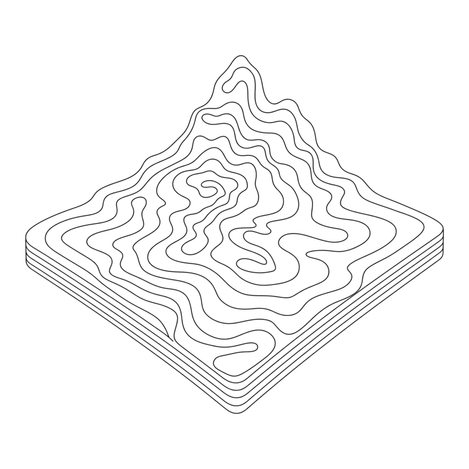
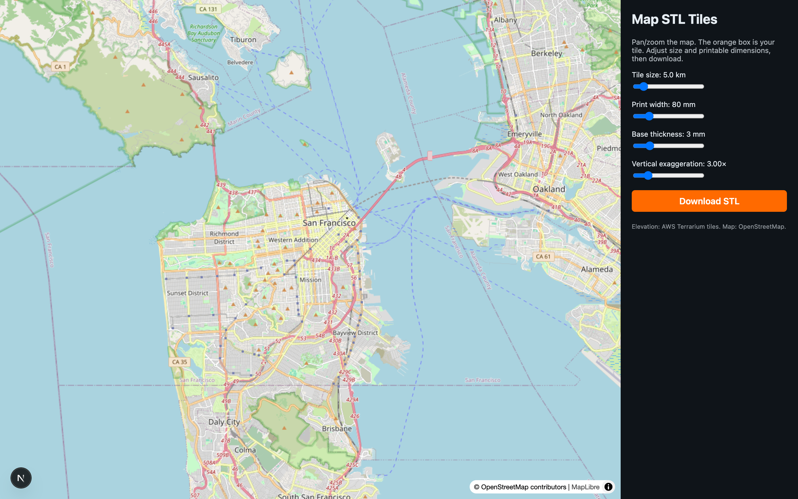

<table border="0" cellspacing="0" cellpadding="0">
<tr>
<td width="220" valign="middle">
<picture>
<source media="(prefers-color-scheme: dark)" srcset="docs/assets/logo-dark.png">

</picture>
</td>
<td valign="middle"><h1>M&nbsp;A&nbsp;P &nbsp; S&nbsp;T&nbsp;L &nbsp; T&nbsp;I&nbsp;L&nbsp;E&nbsp;S</h1></td>
</tr>
</table>

**Live: https://map-stl-tiles.vercel.app**

Next.js app: pan/zoom an OpenStreetMap view, pick a square area, download a binary STL of the terrain ready to 3D print.

## How it works

- **Map UI**: MapLibre GL with OSM raster tiles. An orange overlay rectangle marks the selection, sized by a slider in kilometers and centered on the map's current center.
- **Elevation**: AWS Terrarium PNG terrain tiles (`s3.amazonaws.com/elevation-tiles-prod/terrarium`). The server picks a zoom giving ≥200 samples across the bbox, fetches the covering tiles, decodes elevation per pixel, and bilinearly indexes a 200×200 heightmap.
- **STL**: a binary STL is generated on the server with a top surface (triangle grid), four side walls, and a flat bottom. The longer axis is scaled to your chosen print width; a configurable solid base is added below the lowest elevation; vertical exaggeration is a separate slider.

## Run

```bash
npm install
npm run dev
```

Open http://localhost:3000.

## Tuning

- **Tile size (km)** — width of the square selection on the ground.
- **Print width (mm)** — physical width of the longer side of the printed tile.
- **Base thickness (mm)** — flat slab below the lowest terrain point.
- **Vertical exaggeration** — multiplies real-world height. 1× is true-to-scale; mountains usually need 1.5–3× to read.

## Attribution

- Map: © OpenStreetMap contributors
- Elevation: AWS Terrain Tiles (Mapzen Terrarium)

## Screenshot


